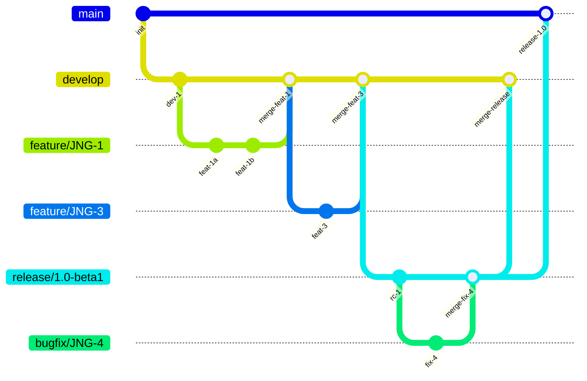
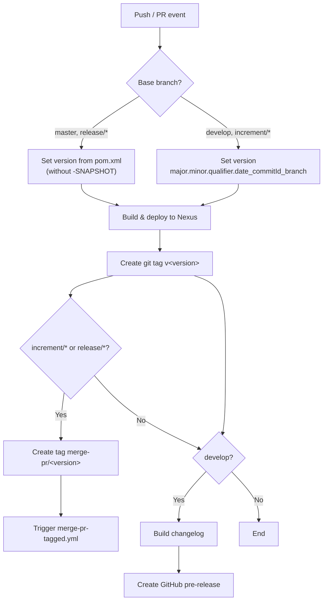
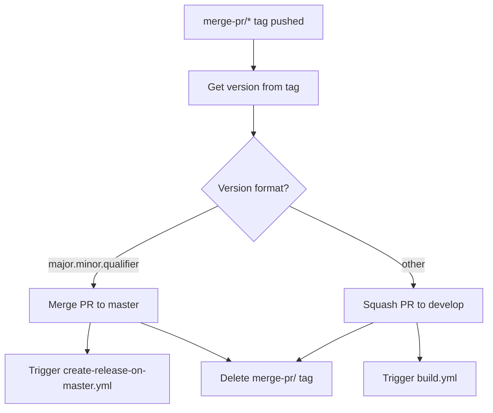
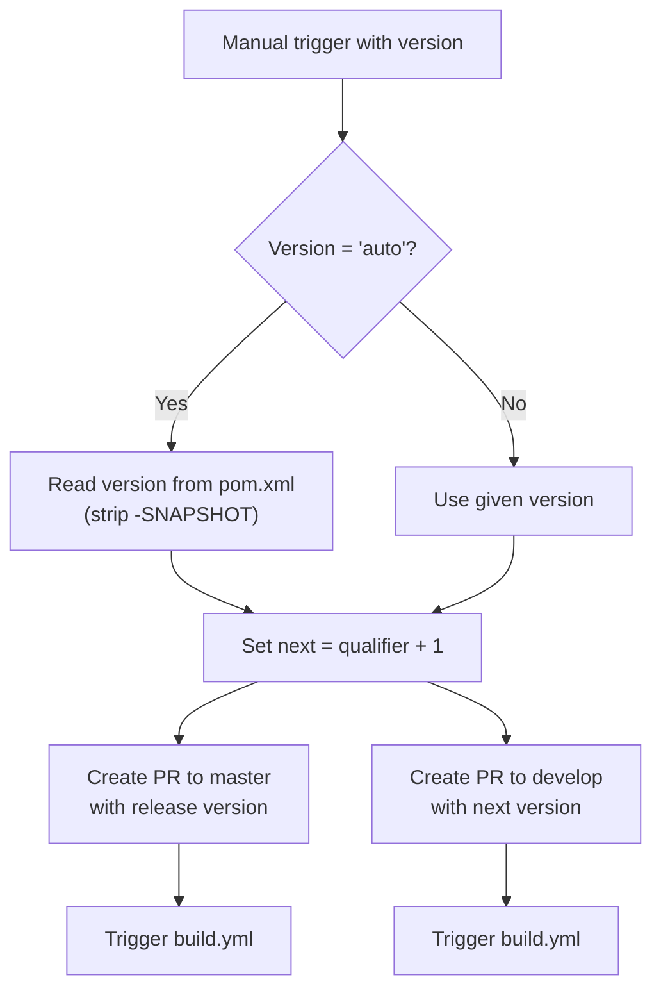

# Development Version and Branch Handling

This document describes the Git branching strategy, version numbering, and CI/CD automation used by this project.

## Branches

The versioning policy follows [GitFlow](https://www.atlassian.com/git/tutorials/comparing-workflows/gitflow-workflow).

| Branch Pattern | Purpose |
|----------------|---------|
| `develop` | Main development branch — contains the latest sources for the active version |
| `feature/JNG-NUMBER_short_summary` | Feature branches, based on `develop` |
| `(release/)X.Y.Z` | Release branches (`release/` prefix reserved for CI) |
| `bugfix/JNG-NUMBER_short_summary` | Bugfix branches, based on release branches; must be applied to release and develop branches of newer versions too |
| `support/JNG-NUMBER_short_summary` | Support branches, based on release branches; same merge-forward policy as bugfix |
| `master` | Contains the latest released sources |

## Version Numbers

Version numbers follow [semantic versioning](https://semver.org/) with these rules:

| Event | Version change |
|-------|---------------|
| Start a `feature/` branch | No version change |
| Start a `release/` branch | 2nd number (minor) incremented on `develop` |
| Start a `bugfix/` branch | No version change (applied to release branch) |
| Start a `support/` branch | 3rd number (patch) incremented |
| Start a `hotfix/` branch | 4th number incremented (applied to both release and master) |

## GitHub Actions Workflows

### build.yml — Main Build Pipeline

Triggered on: push to `develop`, or pull request targeting `develop`, `master`, `increment/*`, or `release/*`.

### merge-pr-tagged.yml — PR Merge Automation

Triggered when a `merge-pr/*` tag is pushed.

### create-release-on-master.yml — Master Release

Triggered on push to `master`. Gets the version from the tag, builds a changelog, and creates a GitHub release (marked as latest).

### release.yml — Manual Release Trigger

Manually triggered with a version parameter (`auto` or a specific `major.minor.qualifier`).

## Development Rules

> **Important:** There is no commit without a ticket number. Every pull request and commit must include a JIRA ticket reference (e.g., `JNG-xxx`).

Issue tracking: [JIRA Dashboard](https://blackbelt.atlassian.net/jira/dashboards)
