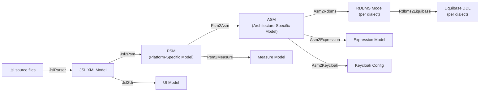
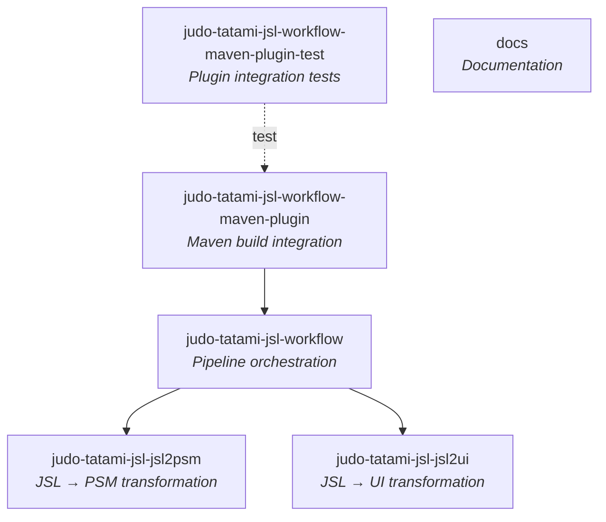

# JUDO Tatami JSL

[](https://github.com/BlackBeltTechnology/judo-tatami-jsl/actions/workflows/build.yml)

## What This Project Does

JUDO Tatami JSL is a **model transformation framework** that converts [JSL (JUDO Specification Language)](https://github.com/BlackBeltTechnology/judo-meta-jsl) source files into multiple runtime-ready target models. It is the core code generation engine for the JUDO platform: you write a `.jsl` model definition, and this project produces the platform-specific model (PSM), UI model, database schemas, Liquibase DDL, and expression models needed to run a full application.

The transformation engine is built on [Eclipse Epsilon](https://eclipse.org/epsilon/) and packaged as a Maven plugin so it integrates into standard Java build pipelines.

## Transformation Pipeline

The following diagram shows the full model transformation chain this project implements:



### Model Descriptions

| Model | Description |
|-------|-------------|
| **JSL** | The JUDO Specification Language source. Human-written `.jsl` files that define the domain model. |
| **PSM** | Platform Specific Model. The formal JUDO domain definition in XMI format. |
| **ASM** | Architecture Specific Model. An Ecore metamodel-based XMI representation of the PSM, consumed directly by the runtime platform. |
| **UI** | User Interface model. Describes frontend views, navigation, widgets, and data bindings. |
| **Measure** | Measurement model for correct unit handling. |
| **RDBMS** | Relational database model in XMI form, generated per database dialect (PostgreSQL, HSQLDB). |
| **Liquibase** | DDL generation model for creating/migrating the database schema. |
| **Expression** | Expression model for query and derived attribute evaluation. |
| **Keycloak** | (Optional) Identity and access management configuration. |

## Module Structure



## Quick Start

### Requirements

- **Java 21** JDK
- **Maven 3.9.4+**

### Build

```bash
mvn clean install           # Full build
mvn clean test              # Run all tests
```

### Use in a Project

Add the Maven plugin to your project's `pom.xml`:

```xml
<plugin>
    <groupId>hu.blackbelt.judo.tatami</groupId>
    <artifactId>judo-tatami-jsl-workflow-maven-plugin</artifactId>
    <version>LATEST_VERSION</version>
    <executions>
        <execution>
            <id>generate-application-from-jsl</id>
            <goals>
                <goal>default-model-workflow</goal>
            </goals>
            <phase>generate-sources</phase>
        </execution>
    </executions>
</plugin>
```

See the [Workflow Maven Plugin documentation](docs/pages/judo-tatami-jsl-workflow-maven-plugin.md) for all configuration parameters and a complete example.

## Context

This project is a building block of the [judo-community](https://github.com/BlackBeltTechnology/judo-community) aggregator project. Check the corresponding documentation to understand how this module fits into the wider JUDO ecosystem.

## Contributing

Everyone is welcome to contribute to JUDO! Please read the [CONTRIBUTING](CONTRIBUTING.md) guide for details.

## License

This project is licensed under the [Eclipse Public License - v 2.0](https://www.eclipse.org/legal/epl-2.0/).
