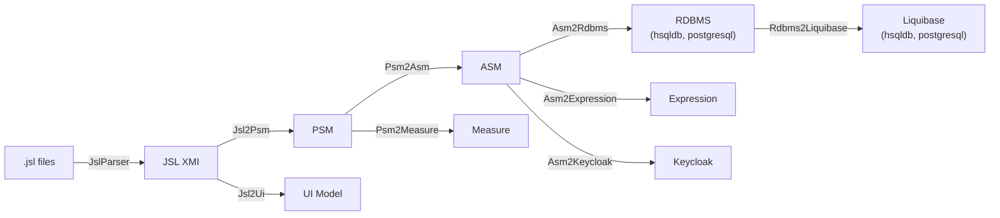

# Tatami JSL Workflow Maven Plugin

This plugin manages and executes the complete JUDO JSL model transformation pipeline during a Maven build. It takes `.jsl` source files and generates all the runtime models needed by the JUDO platform: PSM, ASM, UI, RDBMS schemas, Liquibase DDL, expression models, and optionally Keycloak configuration.

## Requirements

- Java 21+
- Maven 3.9.4+

## Installation

Add the plugin to your `pom.xml`. Replace `LATEST_VERSION` with the current release version.

```xml
<plugin>
    <groupId>hu.blackbelt.judo.tatami</groupId>
    <artifactId>judo-tatami-jsl-workflow-maven-plugin</artifactId>
    <version>LATEST_VERSION</version>
    <executions>
        <execution>
            <id>generate-application-from-jsl</id>
            <goals>
                <goal>default-model-workflow</goal>
            </goals>
            <phase>generate-sources</phase>
        </execution>
    </executions>
</plugin>
```

## Generation Pipeline

The plugin runs a multi-stage model transformation pipeline that starts with `.jsl` source files and produces all models needed by the JUDO runtime.



### Model Descriptions

| Model | What it is |
|-------|------------|
| **JslDsl** | The JUDO Specification Language source code (`.jsl` files). |
| **JSL** | The XMI representation of JslDsl, parsed from the source. |
| **PSM** | Platform-Specific Model — the formal JUDO domain definition in XMI format. |
| **ASM** | Architecture-Specific Model — Ecore metamodel-based XMI representation used by the platform runtime. |
| **UI** | User Interface model — describes views, widgets, navigation, and data bindings for frontend generation. |
| **Measure** | Measurement model for correct unit handling. |
| **RDBMS** | Relational database model in XMI, generated per database dialect. |
| **Liquibase** | DDL generation model for creating and migrating the database schema. |
| **Expression** | Expression model for query evaluation and derived attributes. |
| **Keycloak** | (Optional) Identity and access management configuration. |

## Plugin Parameters

Below is the full configuration with all available parameters and their defaults:

```xml
<execution>
    <id>execute-jsl-transformation</id>
    <phase>compile</phase>
    <goals>
        <goal>default-workflow</goal>
    </goals>
    <configuration>
        <sources>${project.basedir}/src/main/resources/model</sources>
        <destination>${project.basedir}/target/generated-sources/model</destination>
        <modelNames/>
        <modelVersion>${project.version}</modelVersion>

        <useDependencies>false</useDependencies>

        <dialects>hsqldb,postgresql</dialects>

        <ignoreJsl2Psm>false</ignoreJsl2Psm>
        <ignoreJsl2Ui>false</ignoreJsl2Ui>
        <ignorePsm2Asm>false</ignorePsm2Asm>
        <ignorePsm2AsmTrace>false</ignorePsm2AsmTrace>
        <ignorePsm2Measure>false</ignorePsm2Measure>
        <ignorePsm2MeasureTrace>false</ignorePsm2MeasureTrace>
        <ignoreAsm2Rdbms>false</ignoreAsm2Rdbms>
        <ignoreAsm2RdbmsTrace>false</ignoreAsm2RdbmsTrace>
        <ignoreRdbms2Liquibase>false</ignoreRdbms2Liquibase>
        <ignoreAsm2Expression>false</ignoreAsm2Expression>
        <useCache>false</useCache>
        <runInParallel>true</runInParallel>
        <saveModels>true</saveModels>
        <enableMetrics>true</enableMetrics>
        <validateModels>false</validateModels>
        <rdbmsCreateSimpleName>false</rdbmsCreateSimpleName>
        <rdbmsNameSize>-1</rdbmsNameSize>
        <rdbmsShortNameSize>-1</rdbmsShortNameSize>
        <rdbmsTablePrefix>T_</rdbmsTablePrefix>
        <rdbmsColumnPrefix>C_</rdbmsColumnPrefix>
        <rdbmsForeignKeyPrefix>FK_</rdbmsForeignKeyPrefix>
        <rdbmsInverseForeignKeyPrefix>FK_INV_</rdbmsInverseForeignKeyPrefix>
        <rdbmsJunctionTablePrefix>J_</rdbmsJunctionTablePrefix>
        <rdbmsTableNameMaxSize>-1</rdbmsTableNameMaxSize>
        <rdbmsColumnNameMaxSize>-1</rdbmsColumnNameMaxSize>
        <ignoreAsm2Keycloak>true</ignoreAsm2Keycloak>
        <ignoreAsm2KeycloakTrace>true</ignoreAsm2KeycloakTrace>
    </configuration>
</execution>
```

### Parameter Reference

#### Source and Destination

| Parameter | Default | Description |
|-----------|---------|-------------|
| `sources` | `src/main/resources/model` | Comma-separated list of source URIs. Can be filesystem directories (scanned recursively for `.jsl` files) or Maven artifact URIs. |
| `destination` | `${project.basedir}/target/generated-sources/model` | Output directory for all generated models, traces, and source code. |
| `modelNames` | *(all)* | Logical model names to compile. When multiple `.jsl` files exist, this limits which models are processed. |
| `modelVersion` | `${project.version}` | Version string stored in generated models. |
| `useDependencies` | `false` | When `true`, scans all Maven dependencies transitively for `.jsl` files. |

> **Important:** If generated source code needs to be compiled, either use `build-helper-maven-plugin` to add the source folder, or enable the `compileSdk` and `createSdkJar` options.

URI parameters support both filesystem paths and Maven coordinates:
`mvn:<groupId>:<artifactId>[:<extension>[:<classifier>]]:<version>[!path/in/archive]`

#### Transformation Toggles

Each transformation step can be individually disabled:

| Parameter | Default | Description |
|-----------|---------|-------------|
| `ignoreJsl2Psm` | `false` | Skip JSL → PSM transformation |
| `ignoreJsl2Ui` | `false` | Skip JSL → UI transformation |
| `ignorePsm2Asm` | `false` | Skip PSM → ASM transformation |
| `ignorePsm2Measure` | `false` | Skip PSM → Measure transformation |
| `ignoreAsm2Rdbms` | `false` | Skip ASM → RDBMS transformation |
| `ignoreAsm2Expression` | `false` | Skip ASM → Expression transformation |
| `ignoreRdbms2Liquibase` | `false` | Skip RDBMS → Liquibase transformation |
| `ignoreAsm2Keycloak` | `true` | Skip ASM → Keycloak transformation |

#### Trace Toggles

Transformation traces map source elements to target elements, useful for debugging and impact analysis:

| Parameter | Default | Description |
|-----------|---------|-------------|
| `ignorePsm2AsmTrace` | `true` | Skip PSM → ASM trace generation |
| `ignorePsm2MeasureTrace` | `true` | Skip PSM → Measure trace generation |
| `ignoreAsm2RdbmsTrace` | `false` | Skip ASM → RDBMS trace generation |
| `ignoreAsm2KeycloakTrace` | `false` | Skip ASM → Keycloak trace generation |

#### Execution Options

| Parameter | Default | Description |
|-----------|---------|-------------|
| `runInParallel` | `true` | Run independent transformations in parallel on multicore systems |
| `enableMetrics` | `true` | Collect and report transformation timing statistics |
| `validateModels` | `false` | Validate models on load and save |
| `saveModels` | `false` | Persist transformed models to the destination directory |
| `useCache` | `false` | Cache intermediate transformation results |
| `dialects` | `hsqldb,postgresql` | Comma-separated list of database dialects to generate for |

#### RDBMS Naming Configuration

| Parameter | Default | Description |
|-----------|---------|-------------|
| `rdbmsCreateSimpleName` | `false` | Use model name directly as SQL name (no namespace collision check) |
| `rdbmsNameSize` | `-1` | Full SQL name size limit; `-1` uses database-specific default |
| `rdbmsShortNameSize` | `-1` | Short SQL name (namespace fragment) size; `-1` uses database-specific default |
| `rdbmsTablePrefix` | `T_` | Prefix for table names; use `-` for no prefix |
| `rdbmsColumnPrefix` | `C_` | Prefix for column names; use `-` for no prefix |
| `rdbmsForeignKeyPrefix` | `FK_` | Prefix for foreign key names; use `-` for no prefix |
| `rdbmsInverseForeignKeyPrefix` | `FK_INV_` | Prefix for inverse foreign key names; use `-` for no prefix |
| `rdbmsJunctionTablePrefix` | `J_` | Prefix for junction table names; use `-` for no prefix |
| `rdbmsTableNameMaxSize` | `-1` | Maximum table name length; `-1` uses database-specific default |
| `rdbmsColumnNameMaxSize` | `-1` | Maximum column name length; `-1` uses database-specific default |

## Complete Example

### JSL Model

`src/main/model/salesmodel.jsl`:

```
model SalesModel;

type numeric Integer(precision = 9, scale = 0);
type string String(min-size = 0, max-size = 128);
type string PhoneNumber(min-size = 0, max-size = 32, regex = "^(\\+\\d{1,2}\\s)?\\(?\\d{3}\\)?[\\s.-]\\d{3}[\\s.-]\\d{4}$");
type boolean Boolean;

type date Date;
type timestamp Timestamp;
type binary Binary(mime-types = ["text/plain"], max-file-size=1 GB);

error MyError {
    field Integer code;
    field String msg = "Internal Server Error";
}

error MyExtendedError extends MyError {
    field Integer extra = 0;
}

enum LeadStatus {
    OPPORTUNITY = 0;
    LEAD = 1;
    PROJECT = 2;
}

entity abstract Person {
    field String firstName;
    field String lastName;
    relation Lead[] leadsNoOpposite;
    derived String fullName => self.firstName + " "
        + self.lastName ;
}

entity SalesPerson extends Person {
    relation Lead[] leads opposite salesPerson;
    derived Lead[] leadsOver10 => self.leadsOver(limit = 10);
    derived Integer numberOfLeads => self.leads!size();
}

entity Lead {
    field Integer value = 100000;
    relation required SalesPerson salesPerson opposite leads;
    constraint ValueMoreThan10 self.value > 10 onerror MyError(code = 10, msg = "Error message");
}

entity Customer {
    identifier required String name;
    relation Lead lead opposite-add customer;
}
```

### Maven POM

```xml
<project xmlns="http://maven.apache.org/POM/4.0.0"
         xmlns:xsi="http://www.w3.org/2001/XMLSchema-instance"
         xsi:schemaLocation="http://maven.apache.org/POM/4.0.0 http://maven.apache.org/xsd/maven-4.0.0.xsd">
    <modelVersion>4.0.0</modelVersion>

    <groupId>hu.blackbelt.judo.test</groupId>
    <version>1.0.0-SNAPSHOT</version>
    <artifactId>judo-sales-model</artifactId>
    <packaging>jar</packaging>

    <properties>
        <project.build.sourceEncoding>UTF-8</project.build.sourceEncoding>
        <maven.compiler.source>21</maven.compiler.source>
        <maven.compiler.target>21</maven.compiler.target>

        <judo-runtime-core-version>1.0.6</judo-runtime-core-version>
        <judo-tatami-jsl-version>1.1.0</judo-tatami-jsl-version>
    </properties>

    <build>
        <plugins>
            <!-- 1. Run the JSL transformation pipeline -->
            <plugin>
                <groupId>hu.blackbelt.judo.tatami</groupId>
                <artifactId>judo-tatami-jsl-workflow-maven-plugin</artifactId>
                <version>${judo-tatami-jsl-version}</version>
                <executions>
                    <execution>
                        <id>generate-models</id>
                        <goals>
                            <goal>default-model-workflow</goal>
                        </goals>
                        <phase>generate-sources</phase>
                    </execution>
                </executions>
                <configuration>
                    <modelNames>SalesModel</modelNames>
                    <sources>${basedir}/src/main/model</sources>
                    <dialects>hsqldb</dialects>
                </configuration>
            </plugin>

            <!-- 2. Add generated SDK source to the compile path -->
            <plugin>
                <groupId>org.codehaus.mojo</groupId>
                <artifactId>build-helper-maven-plugin</artifactId>
                <version>3.3.0</version>
                <executions>
                    <execution>
                        <id>add-source</id>
                        <phase>generate-sources</phase>
                        <goals>
                            <goal>add-source</goal>
                        </goals>
                        <configuration>
                            <sources>
                                <source>${project.basedir}/target/model/sdk/SalesModel</source>
                            </sources>
                        </configuration>
                    </execution>
                </executions>
            </plugin>
        </plugins>
    </build>

    <dependencyManagement>
        <dependencies>
            <dependency>
                <groupId>hu.blackbelt.judo.runtime</groupId>
                <artifactId>judo-runtime-core-dependencies</artifactId>
                <version>${judo-runtime-core-version}</version>
                <type>pom</type>
                <scope>import</scope>
            </dependency>
            <dependency>
                <groupId>hu.blackbelt.judo.tatami</groupId>
                <artifactId>judo-tatami-jsl-jsl2psm</artifactId>
                <version>${judo-tatami-jsl-version}</version>
            </dependency>
            <dependency>
                <groupId>hu.blackbelt.judo.tatami</groupId>
                <artifactId>judo-tatami-jsl-workflow</artifactId>
                <version>${judo-tatami-jsl-version}</version>
            </dependency>
        </dependencies>
    </dependencyManagement>

    <dependencies>
        <dependency>
            <groupId>hu.blackbelt.judo.runtime</groupId>
            <artifactId>judo-runtime-core</artifactId>
        </dependency>
        <dependency>
            <groupId>hu.blackbelt.judo.runtime</groupId>
            <artifactId>judo-runtime-core-guice-hsqldb</artifactId>
        </dependency>
        <dependency>
            <groupId>hu.blackbelt.judo</groupId>
            <artifactId>judo-dao-api</artifactId>
        </dependency>
        <dependency>
            <groupId>hu.blackbelt.judo</groupId>
            <artifactId>judo-dispatcher-api</artifactId>
        </dependency>
        <dependency>
            <groupId>hu.blackbelt.judo</groupId>
            <artifactId>judo-sdk-common</artifactId>
        </dependency>
        <dependency>
            <groupId>hu.blackbelt.judo.meta</groupId>
            <artifactId>hu.blackbelt.judo.meta.asm.model</artifactId>
        </dependency>
        <dependency>
            <groupId>hu.blackbelt.mapper</groupId>
            <artifactId>mapper-api</artifactId>
        </dependency>
        <dependency>
            <groupId>org.junit.jupiter</groupId>
            <artifactId>junit-jupiter</artifactId>
            <version>5.8.2</version>
            <scope>test</scope>
        </dependency>
    </dependencies>
</project>
```

### Test Class

`src/test/java/hu/blackbelt/judo/test/salesmodel/SalesModelTest.java`:

```java
package hu.blackbelt.judo.test.salesmodel;

import com.google.inject.Guice;
import com.google.inject.Inject;
import com.google.inject.Injector;
import hu.blackbelt.judo.runtime.core.guice.JudoDefaultModule;
import hu.blackbelt.judo.runtime.core.guice.JudoModelHolder;
import hu.blackbelt.judo.runtime.core.guice.dao.rdbms.hsqldb.JudoHsqldbModules;
import hu.blackbelt.judo.runtime.core.dao.rdbms.hsqldb.HsqldbDialect;
import hu.blackbelt.judo.test.salesmodel.daoprovider.salesmodel.SalesModelDaoModules;
import hu.blackbelt.judo.test.salesmodel.sdk.salesmodel.salesmodel.Person;
import hu.blackbelt.judo.test.salesmodel.sdk.salesmodel.salesmodel.SalesPerson;
import hu.blackbelt.judo.sdk.query.StringFilter;
import lombok.extern.slf4j.Slf4j;
import org.junit.jupiter.api.BeforeEach;
import org.junit.jupiter.api.Test;

import java.io.File;
import java.util.List;

import static org.junit.jupiter.api.Assertions.assertEquals;

@Slf4j
class SalesModelTest {

    Injector injector;                              // Guice injector for service lookup

    @Inject
    SalesPerson.SalesPersonDao salesPersonDao;      // Generated SDK DAO

    @Inject
    Person.PersonDao personDao;                     // Generated SDK DAO

    @BeforeEach
    void init() {
        // Load generated runtime models from the filesystem
        JudoModelHolder modelHolder = JudoModelHolder
                .loadFromURL("SalesModel", new File("target/model").toURI(), new HsqldbDialect());

        // Wire up Guice modules: HSQLDB runtime + generated DAOs
        injector = Guice.createInjector(
                JudoHsqldbModules.builder().build(),
                new SalesModelDaoModules(),
                new JudoDefaultModule(this, modelHolder));
    }

    @Test
    public void test() {
        // Create a SalesPerson via the generated DAO
        SalesPerson createdSalesPerson = salesPersonDao.create(SalesPerson.builder()
                .withFirstName("Test")
                .withLastName("Elek")
                .build());

        assertEquals("Test", createdSalesPerson.getFirstName());
        assertEquals("Elek", createdSalesPerson.getLastName());

        // Search using generated filter API
        List<SalesPerson> personList = salesPersonDao.search()
                .filterByFirstName(StringFilter.equalTo("Test"))
                .execute();

        assertEquals(1, personList.size());

        // Create a Person (abstract entity becomes concrete via generated SDK)
        Person createdPerson = personDao.create(Person.builder()
                .withFirstName("Masik")
                .withLastName("Test")
                .build());

        assertEquals("Masik", createdPerson.getFirstName());
        assertEquals("Test", createdPerson.getLastName());
    }
}
```

**Key points about the example:**

1. `judo-runtime-core-version` — the runtime that loads and executes the transformed models
2. `judo-tatami-jsl-version` — the Tatami JSL version for the transformation plugin
3. `build-helper-maven-plugin` — adds generated SDK source code into the normal Maven compilation pipeline
