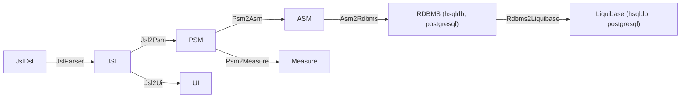

# Tatami JSL Workflow Maven Plugin

This plugin manages and executes generators for JUDO JSL Application codes.

It generates persistence DAO's and Guice Injector based bootstrap.

## Requirements

- Maven 3.6 and Java 21

## Installation

Include the plugin as a dependency in your Maven project. Change `LATEST_VERSION` to the latest tagged version.

Generating application with minimal settings.

```xml
<plugin>
    <groupId>hu.blackbelt.judo.tatami</groupId>
    <artifactId>judo-tatami-jsl-workflow-maven-plugin</artifactId>
    <version>LATEST_VERSION</version>
    <executions>
        <execution>
            <id>generate-application-from-jsl</id>
            <goals>
                <goal>default-model-workflow</goal>
            </goals>
            <phase>generate-sources</phase>
        </execution>
    </executions>
</plugin>
```

## Generation Pipeline

The plugin executes model conversion pipeline started with the `.jsl` defined models.
The different models represent different architectural models, which are used by
the corresponding architectural element.

Model pipeline for `.jsl`:



- **JslDsl** - The JUDO Specification Language model. The source code of the model.
- **JSL** - The XMI representation of JslDsl.
- **PSM** - Platform Specific Model. It is the formal JUDO definition of platform domain in XMI format.
- **ASM** - Architecture Specific Model. It is Ecore metamodel based XMI representation of PSM. This model and its derivative models are used by the platform.
- **UI** - User Interface Model. Generated from JSL frontend/view/row declarations.
- **Measure** - Special measure model, which helps the correct measurement handling.
- **RDBMS** - Relational Data Model in XMI form. It is generated in dialect-dependent form.
- **Liquibase** - This model contains RDBMS model definition for DDL generation. It will create the RDBMS schema in a database for the defined ASM model.

## Plugin Parameters

```xml
<execution>
    <id>execute-jsl-transformation</id>
    <phase>compile</phase>
    <goals>
        <goal>default-workflow</goal>
    </goals>
    <configuration>
        <sources>${project.basedir}/src/main/resources/model</sources>         <!-- 1 -->
        <destination>${project.basedir}/target/generated-sources/model</destination> <!-- 2 -->
        <modelNames/>                                                           <!-- 3 -->
        <modelVersion>${project.version}</modelVersion>                         <!-- 4 -->

        <useDependencies>false</useDependencies>                                <!-- 5 -->

        <dialects>hsqldb,postgresql</dialects>                                  <!-- 6 -->

        <transformationMode>ETL</transformationMode>                            <!-- 7 -->

        <ignoreJsl2Psm>false</ignoreJsl2Psm>                                   <!-- 8 -->
        <ignoreJsl2Ui>false</ignoreJsl2Ui>                                     <!-- 9 -->
        <ignorePsm2Asm>false</ignorePsm2Asm>                                  <!-- 10 -->
        <ignorePsm2AsmTrace>false</ignorePsm2AsmTrace>                        <!-- 11 -->
        <ignorePsm2Measure>false</ignorePsm2Measure>                          <!-- 12 -->
        <ignorePsm2MeasureTrace>false</ignorePsm2MeasureTrace>                <!-- 13 -->
        <ignoreAsm2Rdbms>false</ignoreAsm2Rdbms>                              <!-- 14 -->
        <ignoreAsm2RdbmsTrace>false</ignoreAsm2RdbmsTrace>                    <!-- 15 -->
        <ignoreRdbms2Liquibase>false</ignoreRdbms2Liquibase>                  <!-- 16 -->
        <ignoreAsm2Expression>false</ignoreAsm2Expression>                    <!-- 17 -->
        <useCache>false</useCache>                                             <!-- 18 -->
        <runInParallel>true</runInParallel>                                    <!-- 19 -->
        <saveModels>true</saveModels>                                          <!-- 20 -->
        <enableMetrics>true</enableMetrics>                                    <!-- 21 -->
        <validateModels>false</validateModels>                                 <!-- 22 -->
        <rdbmsCreateSimpleName>false</rdbmsCreateSimpleName>                   <!-- 23 -->
        <rdbmsNameSize>-1</rdbmsNameSize>                                      <!-- 24 -->
        <rdbmsShortNameSize>-1</rdbmsShortNameSize>                            <!-- 25 -->
        <rdbmsTablePrefix>T_</rdbmsTablePrefix>                                <!-- 26 -->
        <rdbmsColumnPrefix>C_</rdbmsColumnPrefix>                              <!-- 27 -->
        <rdbmsForeignKeyPrefix>FK_</rdbmsForeignKeyPrefix>                    <!-- 28 -->
        <rdbmsInverseForeignKeyPrefix>FK_INV_</rdbmsInverseForeignKeyPrefix>  <!-- 29 -->
        <rdbmsJunctionTablePrefix>J_</rdbmsJunctionTablePrefix>               <!-- 30 -->
        <rdbmsTableNameMaxSize>-1</rdbmsTableNameMaxSize>                      <!-- 31 -->
        <rdbmsColumnNameMaxSize>-1</rdbmsColumnNameMaxSize>                    <!-- 32 -->
        <ignoreAsm2Keycloak>true</ignoreAsm2Keycloak>                         <!-- 33 -->
        <ignoreAsm2KeycloakTrace>true</ignoreAsm2KeycloakTrace>               <!-- 34 -->
    </configuration>
</execution>
```

URI type parameters can be file or mvn with the following coordinate:
`mvn:<groupId>:<artifactId>[:<extension>[:<classifier>]]:<version>[!path/in/archive]`

| # | Parameter | Default | Description |
|---|-----------|---------|-------------|
| 1 | `sources` | `src/main/resources/model` | Sources URI. Comma-separated list. When models are defined, adds them; when a directory, scans recursively for `.jsl` files. |
| 2 | `destination` | `${project.basedir}/target/generated-sources/model` | Destination path where transformation output is generated. Contains intermediate models, traces and source code. |
| 3 | `modelNames` | (none) | Logical model names. When multiple `.jsl` files exist, only compile the listed models. |
| 4 | `modelVersion` | `${project.version}` | Version number stored in generated models. |
| 5 | `useDependencies` | `false` | Use maven dependencies as source of JSL files. Scans all dependencies transitively for `.jsl` files. |
| 6 | `dialects` | `hsqldb,postgresql` | Comma-separated list of dialects to generate. Valid: `hsqldb`, `postgresql`. |
| 7 | `transformationMode` | `ETL` | Transformation engine to use. Valid: `ETL`, `ZETA`. |
| 8 | `ignoreJsl2Psm` | `false` | Skip JSL to PSM transformation. |
| 9 | `ignoreJsl2Ui` | `false` | Skip JSL to UI transformation. |
| 10 | `ignorePsm2Asm` | `false` | Skip PSM to ASM transformation. |
| 11 | `ignorePsm2AsmTrace` | `true` | Skip PSM to ASM trace generation. |
| 12 | `ignorePsm2Measure` | `false` | Skip PSM to Measure transformation. |
| 13 | `ignorePsm2MeasureTrace` | `true` | Skip PSM to Measure trace generation. |
| 14 | `ignoreAsm2Rdbms` | `false` | Skip ASM to RDBMS transformation. |
| 15 | `ignoreAsm2RdbmsTrace` | `false` | Skip ASM to RDBMS trace generation. |
| 16 | `ignoreRdbms2Liquibase` | `false` | Skip RDBMS to Liquibase transformation. |
| 17 | `ignoreAsm2Expression` | `false` | Skip ASM to Expression transformation. |
| 18 | `useCache` | `false` | Use cache in model transformations. |
| 19 | `runInParallel` | `true` | Run transformations in parallel when possible. |
| 20 | `saveModels` | `false` | Save models after execution. |
| 21 | `enableMetrics` | `true` | Enable generation time statistics after execution. |
| 22 | `validateModels` | `false` | Validate models on load and save. |
| 23 | `rdbmsCreateSimpleName` | `false` | Use model name as SQL name (no namespace collision check). |
| 24 | `rdbmsNameSize` | `-1` | Full SQL name size (-1 for database default). |
| 25 | `rdbmsShortNameSize` | `-1` | Short SQL name size for namespace fragments (-1 for database default). |
| 26 | `rdbmsTablePrefix` | `T_` | Table name prefix (`-` for no prefix). |
| 27 | `rdbmsColumnPrefix` | `C_` | Column name prefix (`-` for no prefix). |
| 28 | `rdbmsForeignKeyPrefix` | `FK_` | Foreign key prefix (`-` for no prefix). |
| 29 | `rdbmsInverseForeignKeyPrefix` | `FK_INV_` | Inverse foreign key prefix (`-` for no prefix). |
| 30 | `rdbmsJunctionTablePrefix` | `J_` | Junction table prefix (`-` for no prefix). |
| 31 | `rdbmsTableNameMaxSize` | `-1` | Maximum table name size (-1 for database default). |
| 32 | `rdbmsColumnNameMaxSize` | `-1` | Maximum column name size (-1 for database default). |
| 33 | `ignoreAsm2Keycloak` | `true` | Skip ASM to Keycloak transformation. |
| 34 | `ignoreAsm2KeycloakTrace` | `true` | Skip ASM to Keycloak trace generation. |

## Example

**`src/main/model/salesmodel.jsl`:**

```
model SalesModel;

type numeric Integer precision:9 scale:0;
type string String min-size:0 max-size:128;
type string PhoneNumber min-size:0 max-size:32 regex:"^(\\+\\d{1,2}\\s)?\\(?\\d{3}\\)?[\\s.-]\\d{3}[\\s.-]\\d{4}$";
type boolean Boolean;

type date Date;
type timestamp Timestamp;
type binary Binary mime-type:["text/plain"] max-file-size:1 GB;

error MyError {
    field Integer code;
    field String msg = "Internal Server Error";
}

error MyExtendedError extends MyError {
    field Integer extra = 0;
}

enum LeadStatus {
    OPPORTUNITY = 0;
    LEAD = 1;
    PROJECT = 2;
}

entity abstract Person {
    field String firstName;
    field String lastName;
    relation Lead[] leadsNoOpposite;
    derived String fullName => self.firstName + " "
        + self.lastName ;
}

entity SalesPerson extends Person {
    relation Lead[] leads opposite salesPerson;
    derived Lead[] leadsOver10 => self.leadsOver(limit = 10);
    derived Integer numberOfLeads => self.leads!size();
}

entity Lead {
    field Integer value = 100000;
    relation required SalesPerson salesPerson opposite leads;
    constraint ValueMoreThan10 self.value > 10 onerror MyError(code = 10, msg = "Error message");
}

entity Customer {
    identifier required String name;
    relation Lead lead opposite-add customer;
}
```

**`pom.xml`:**

```xml
<project xmlns="http://maven.apache.org/POM/4.0.0"
         xmlns:xsi="http://www.w3.org/2001/XMLSchema-instance"
         xsi:schemaLocation="http://maven.apache.org/POM/4.0.0 http://maven.apache.org/xsd/maven-4.0.0.xsd">
    <modelVersion>4.0.0</modelVersion>

    <groupId>hu.blackbelt.judo.test</groupId>
    <version>1.0.0-SNAPSHOT</version>
    <artifactId>judo-sales-model</artifactId>
    <packaging>jar</packaging>

    <properties>
        <project.build.sourceEncoding>UTF-8</project.build.sourceEncoding>
        <maven.compiler.source>21</maven.compiler.source>
        <maven.compiler.target>21</maven.compiler.target>

        <judo-runtime-core-version>1.0.6</judo-runtime-core-version>
        <judo-tatami-jsl-version>1.1.0</judo-tatami-jsl-version>
    </properties>
    <build>
        <plugins>
            <plugin>
                <groupId>hu.blackbelt.judo.tatami</groupId>
                <artifactId>judo-tatami-jsl-workflow-maven-plugin</artifactId>
                <version>${judo-tatami-jsl-version}</version>
                <executions>
                    <execution>
                        <id>generate-models</id>
                        <goals>
                            <goal>default-model-workflow</goal>
                        </goals>
                        <phase>generate-sources</phase>
                    </execution>
                </executions>
                <configuration>
                    <modelNames>SalesModel</modelNames>
                    <sources>${basedir}/src/main/model</sources>
                    <dialects>hsqldb</dialects>
                </configuration>
            </plugin>
        </plugins>
    </build>

    <dependencyManagement>
        <dependencies>
            <dependency>
                <groupId>hu.blackbelt.judo.runtime</groupId>
                <artifactId>judo-runtime-core-dependencies</artifactId>
                <version>${judo-runtime-core-version}</version>
                <type>pom</type>
                <scope>import</scope>
            </dependency>
        </dependencies>
    </dependencyManagement>

    <dependencies>
        <dependency>
            <groupId>hu.blackbelt.judo.runtime</groupId>
            <artifactId>judo-runtime-core</artifactId>
        </dependency>
    </dependencies>
</project>
```
